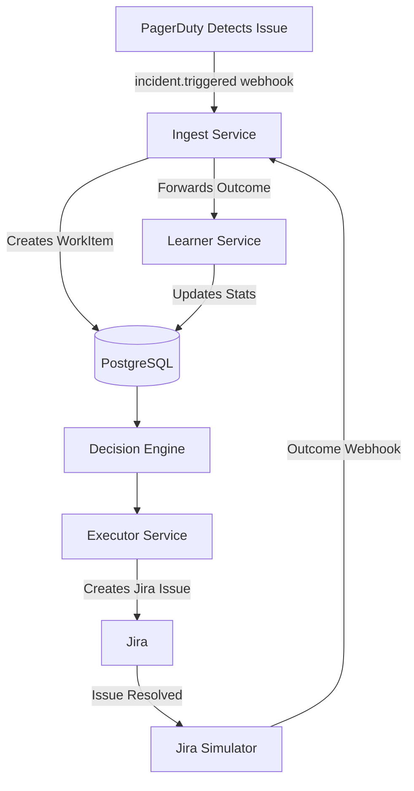

# PagerDuty Integration Guide

This guide explains how to integrate Goliath with PagerDuty for incident ingestion.

## Overview

The PagerDuty integration enables Goliath to:
- **Ingest incidents** from PagerDuty when issues are detected (incident creation)
- **Execute decisions** via Jira (assigning tickets to people)
- **Learn from outcomes** via Jira (when tickets are resolved/reassigned)

**Architecture**: PagerDuty detects issues → creates WorkItems → Decision Engine → Executor creates Jira tickets → Learning from Jira outcomes

## Architecture



**Key Points:**
- **PagerDuty**: Incident detection and creation (ingestion only)
- **Jira**: Execution (assigning tickets to people)
- **Learning**: From Jira outcomes, not PagerDuty

## Setup

### 1. Database Migration

Run the migration script to add PagerDuty support:

```bash
psql $POSTGRES_URL -f scripts/migrations/add_pagerduty_columns.sql
```

This adds:
- `pagerduty_incident_id` to `work_items` table (to track which PagerDuty incident created the WorkItem)
- `pagerduty_user_id` to `humans` table (optional, for future use)

### 2. Configure PagerDuty Webhook

1. Navigate to **Configuration → Integrations → Webhooks**
2. Click **New Webhook Subscription**
3. Configure:
   - **Name**: Goliath Incident Ingestion
   - **Endpoint URL**: `https://your-ingest-service-url/webhooks/pagerduty`
   - **Events**: Select:
     - `incident.triggered` (primary)
     - `incident.created` (alternative)
4. Save the webhook

### 3. Service Mapping Configuration

Configure how PagerDuty service names map to Goliath service names:

**Option 1: Environment Variables**
```bash
export PAGERDUTY_SERVICE_API_SERVICE="api"
export PAGERDUTY_SERVICE_FRONTEND_SERVICE="frontend"
export PAGERDUTY_SERVICE_BACKEND_SERVICE="backend"
```

**Option 2: Default Mapping**
The system includes default mappings in `pagerduty_webhook.py`:
- `api-service` → `api`
- `frontend-service` → `frontend`
- `backend-service` → `backend`
- etc.

### 4. Webhook Security (Optional)

For production, configure webhook signature validation:

```bash
export PAGERDUTY_WEBHOOK_SECRET="your-webhook-secret"
```

Note: Signature validation is currently simplified. For production, implement full HMAC-SHA256 verification.

## How It Works

### Incident Ingestion Flow

1. **PagerDuty detects issue** → Creates incident
2. **PagerDuty sends webhook** → `POST /webhooks/pagerduty` to Ingest service
3. **Ingest processes webhook**:
   - Extracts incident data (title, description, service, urgency)
   - Maps PagerDuty service → Goliath service
   - Maps PagerDuty urgency → Goliath severity (high → sev2, low → sev3)
   - Creates WorkItem in database
   - Stores PagerDuty incident ID for tracking
4. **Decision Engine** → Makes routing decision (existing flow)
5. **Executor** → Creates Jira ticket with assigned person (existing flow)
6. **Jira resolution** → Learning loop updates stats (existing flow)

### Service Mapping

PagerDuty service names are mapped to Goliath service names:
- **Input**: PagerDuty service name (e.g., "api-service")
- **Output**: Goliath service name (e.g., "api")
- **Configurable**: Via environment variables or default mapping

### Severity Mapping

PagerDuty urgency is mapped to Goliath severity:
- **high** → `sev2`
- **low** → `sev3`
- **Default**: `sev3` if urgency unknown

## Testing

### Manual Test

1. **Create PagerDuty incident** (manually or via API):
   ```bash
   curl -X POST https://api.pagerduty.com/incidents \
     -H "Authorization: Token token=YOUR_API_KEY" \
     -H "Content-Type: application/json" \
     -d '{
       "incident": {
         "type": "incident",
         "title": "Test incident for Goliath",
         "service": {"id": "SERVICE_ID", "type": "service_reference"},
         "urgency": "high"
       }
     }'
   ```

2. **Verify webhook received**:
   - Check Ingest service logs
   - Verify WorkItem created in database

3. **Check WorkItem**:
   ```sql
   SELECT id, service, severity, description, pagerduty_incident_id, origin_system
   FROM work_items
   WHERE origin_system LIKE 'PAGERDUTY-%'
   ORDER BY created_at DESC
   LIMIT 1;
   ```

4. **Verify decision made**:
   ```bash
   curl http://localhost:8002/decide \
     -H "Content-Type: application/json" \
     -d '{"work_item_id": "wi-..."}'
   ```

5. **Verify Jira ticket created** (existing flow)

### Webhook Testing

Test webhook locally using ngrok or similar:

```bash
# Start ngrok
ngrok http 8000

# Update PagerDuty webhook URL to ngrok URL
# Trigger incident in PagerDuty
# Check logs for webhook processing
```

## Troubleshooting

### Webhooks Not Received

- Verify webhook URL is accessible (use ngrok for local testing)
- Check PagerDuty webhook configuration
- Review Ingest service logs
- Verify webhook events are enabled (`incident.triggered` or `incident.created`)

### WorkItems Not Created

- Check webhook payload format (review logs)
- Verify service mapping configuration
- Check database connection
- Review error logs in Ingest service

### Service Mapping Issues

- Verify PagerDuty service names match configured mappings
- Check environment variables are set correctly
- Review default mappings in `pagerduty_webhook.py`
- Check logs for mapping warnings

## API Reference

### Ingest Service

**POST /webhooks/pagerduty**

Receives PagerDuty webhook events and creates WorkItems.

**Supported Events:**
- `incident.triggered`: New incident created
- `incident.created`: Incident created (alternative)

**Request Body** (PagerDuty webhook format):
```json
{
  "event": {
    "event_type": "incident.triggered",
    "data": {
      "incident": {
        "id": "INCIDENT_ID",
        "incident_number": "INC-12345",
        "title": "Incident title",
        "urgency": "high",
        "service": {
          "name": "api-service"
        },
        "body": {
          "details": "Incident description"
        },
        "created_at": "2024-01-01T00:00:00Z"
      }
    }
  }
}
```

**Response:**
```json
{
  "status": "success",
  "work_item_id": "wi-20240101000000-abc123",
  "incident_id": "INCIDENT_ID",
  "incident_number": "INC-12345",
  "service": "api",
  "severity": "sev2"
}
```

## Security

- Webhook signature validation available (set `PAGERDUTY_WEBHOOK_SECRET`)
- Use HTTPS for webhook endpoints in production
- Limit webhook access to trusted PagerDuty IPs (if possible)

## Limitations

- Signature validation is simplified (production should implement full HMAC verification)
- Service mapping is basic (name-based, not ID-based)
- Urgency mapping is simple (high/low only, not priority-based)
- No support for incident updates (only creation)

## Future Enhancements

- Full signature verification (HMAC-SHA256)
- Priority-based severity mapping
- Support for incident updates
- Service ID-based mapping (instead of name-based)
- Integration with PagerDuty escalation policies
- Support for on-call schedule integration
